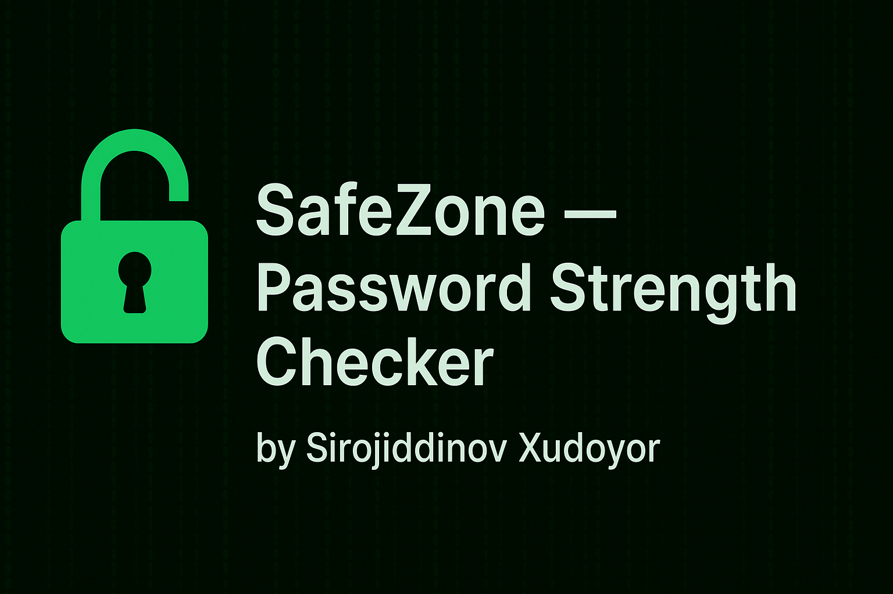

<p align="center">
  
</p>

# 🔐 SafeZone — Password Strength Checker

This project is part of the **SafeZone Cybersecurity Demo Series**.  
It is a web-based tool built with **Python (Flask)** and **JavaScript (zxcvbn)** to help users evaluate and improve the strength of their passwords.

---

## ✨ Features

- ✅ **Server-side analysis** (Python + Flask):
  - Password length, unique characters, digits, uppercase, lowercase, special characters.
  - Scoring system (0–100%) with suggestions for stronger passwords.
- ✅ **Client-side analysis** (JavaScript + zxcvbn):
  - Real-time password strength meter.
  - Instant feedback and improvement tips.
- ✅ **Educational purpose** — helps raise awareness about weak passwords and good practices.
- 🌍 **Open Source** — free to use, modify, and share.

---

## 🖼️ Demo Preview


---

## 🚀 Installation

Clone the repository:

```bash
git clone https://github.com/xudoyor-cyber/password-strength-checker.git
cd password-strength-checker
